# Loan Management System (JAVA_LMS_1_repo)

Full-stack Loan Management System with React frontend and Spring Boot backend.

## Overview

This project implements end-to-end loan lifecycle features:
- User and admin authentication with JWT
- Loan catalog and loan application
- Common KYC submission and admin KYC review
- Admin loan approval/rejection and disbursement
- EMI payments, prepayment, foreclosure
- Stripe checkout flow for EMI payment
- User/admin notifications, analytics, and audit logging

## Feature Highlights

### Authentication and Access Control
- User registration and login
- Admin login
- JWT-based authentication
- Role-based access control for routes and APIs (`USER`, `ADMIN`)

### User Portal
- Loan browsing and detailed loan information pages
- Loan application submission with guided forms
- KYC submission and KYC status tracking
- User profile dashboard
- Repayment schedule visibility
- EMI payment from wallet or Stripe checkout
- Prepayment request creation and tracking
- Foreclosure request and payment flow
- User notifications

### Admin Portal
- Admin dashboard and operational KPIs
- Loan application review and decision support
- KYC verification queue and review actions
- Loan disbursement operations
- Active loan tracker and repayment monitoring
- Prepayment and foreclosure request reviews
- Admin notifications
- Reports, profitability, and analytics views

### Payments and Ledger
- Stripe checkout session creation and server-side finalization
- Pending, success, and failed payment state handling
- Idempotency key checks for payment safety
- Ledger entries for EMI, prepayment, and foreclosure

### Audit and Analytics
- Audit logging for critical backend actions
- Analytics event capture and summary endpoints
- Notification-based workflow updates

## Current Roles

The codebase currently uses two roles:
- `USER`
- `ADMIN`

## Tech Stack

Frontend:
- React (CRA)
- React Router
- Axios
- React Query
- Bootstrap
- Lucide React

Backend:
- Java 21
- Spring Boot 4.0.2
- Spring Security (JWT)
- Spring Data MongoDB
- Stripe Java SDK

Database:
- MongoDB

## Repository Structure

```text
.
|-- frontend/   # React app (port 3000)
|-- backend/    # Spring Boot API (port 8080)
`-- README.md
```

## Prerequisites

- Java 21
- Node.js 18+ and npm
- MongoDB running locally

## Configuration

Backend settings are currently in `backend/src/main/resources/application.yml`.

Important keys:
- `spring.mongodb.uri`
- `jwt.secret`
- `jwt.expiration`
- `stripe.secret-key`
- `stripe.publishable-key`
- `stripe.checkout-success-url`
- `stripe.checkout-cancel-url`

Default local values point to:
- Backend: `http://localhost:8080`
- Frontend: `http://localhost:3000`
- MongoDB: `mongodb://localhost:27017/lms_db`

## Run Locally

1. Start backend

```bash
cd backend
./mvnw spring-boot:run
```

Windows alternative:

```powershell
cd backend
.\mvnw.cmd spring-boot:run
```

2. Start frontend

```bash
cd frontend
npm install
npm start
```

## Testing

Backend tests:

```bash
cd backend
./mvnw test
```

Frontend tests:

```bash
cd frontend
npm test
```

## Key API Groups

Auth:
- `POST /auth/register`
- `POST /auth/login/user`
- `POST /auth/login/admin`

User:
- `GET /user/profile`
- `PUT /user/profile`
- `POST /user/kyc/update`
- `GET /user/kyc/status`
- `GET /user/applications`
- `GET /user/loans`

Loans:
- `GET /loans`
- `GET /loans/{loanId}`
- `POST /loans/apply`
- `GET /loans/application/{applicationId}`

Admin:
- `/admin/loan-applications/**`
- `/admin/users/**`
- `/admin/prepayment-requests/**`
- `/admin/foreclosure-requests/**`
- `/admin/notifications/**`
- `/admin/payments/**`

Payments:
- `POST /payments` (EMI)
- `GET /payments`
- `GET /payments/emi-eligibility`
- `GET /payments/summary`
- `GET /payments/foreclosure/quote`
- `POST /payments/foreclosure/pay`
- `POST /payments/stripe/create-intent`
- `POST /payments/stripe/create-checkout-session`
- `POST /payments/stripe/finalize-checkout`
- `POST /payments/stripe/mark-failed`

## Payment Flow Notes

- Stripe checkout creates a `PENDING` payment record.
- Finalization verifies Stripe session/payment intent before marking success.
- Cancel/timeout/finalize-failure paths can mark payment as `FAILED`.
- Idempotency key checks are used to reduce duplicate payment processing.

## Auth and Access

- JWT is required for protected routes.
- Public routes include `/auth/**` and `GET /loans/**`.
- `/admin/**` requires `ADMIN`.
- `POST /payments/**` requires `USER`.
- `GET /payments/**` supports `USER` and `ADMIN` with route-specific checks.

## Build Commands

Backend build:

```bash
cd backend
./mvnw clean package
```

Frontend production build:

```bash
cd frontend
npm run build
```

## Contributors

See `CONTRIBUTORS.md` for feature-wise ownership by team member.

## Screenshots
### User Screens

#### Home


#### About Us
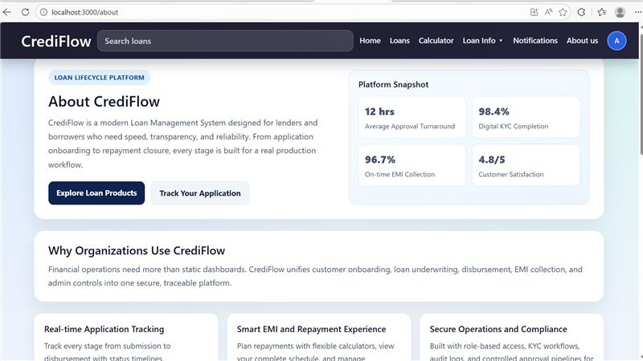

#### Loans
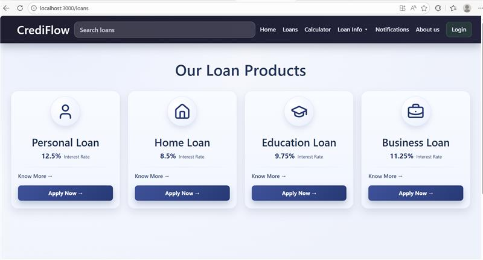

#### Loan Details
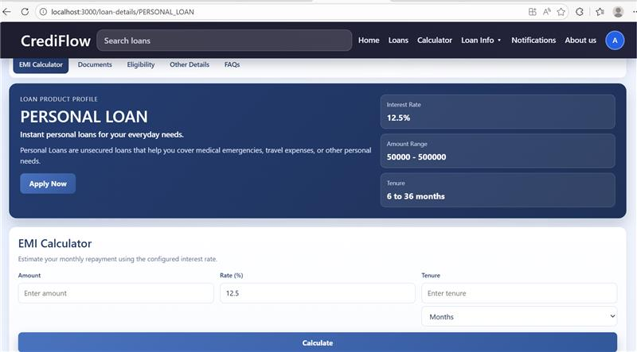

#### Calculator Dashboard
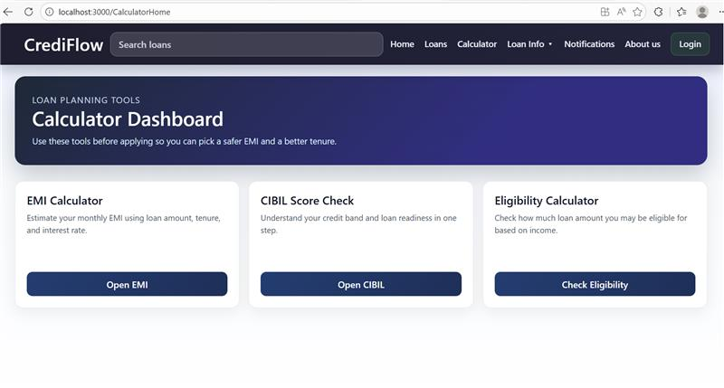

#### Login
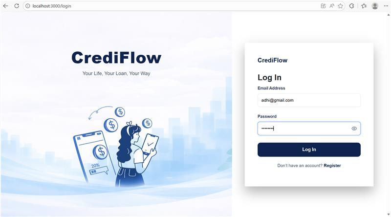

#### Register
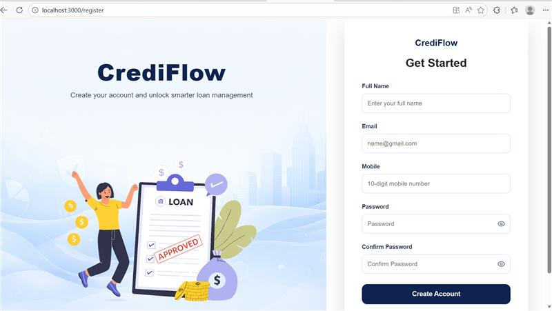

#### User Profile - Overview
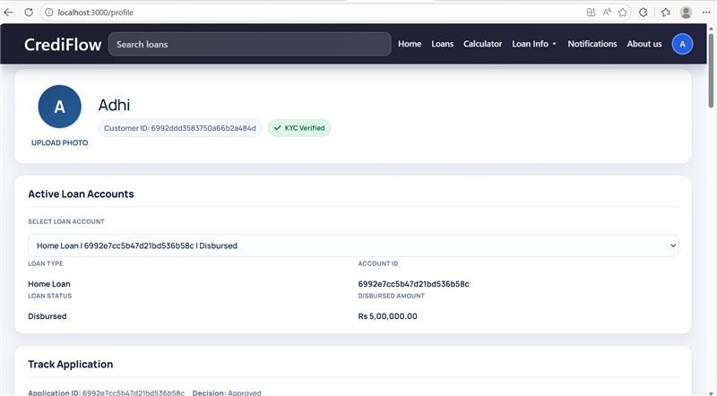

#### User Profile - Tracking and Stats
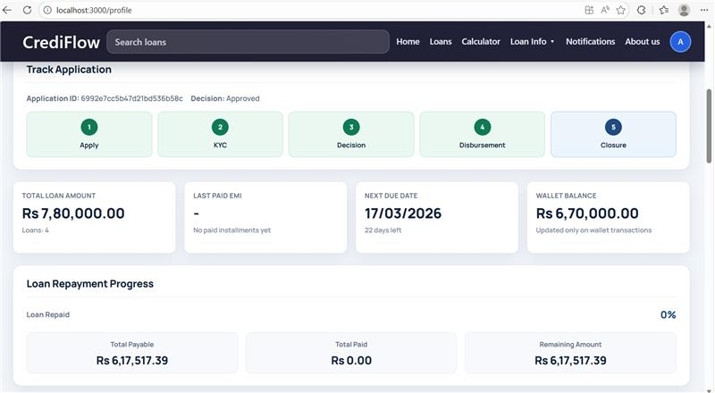

#### User Notifications
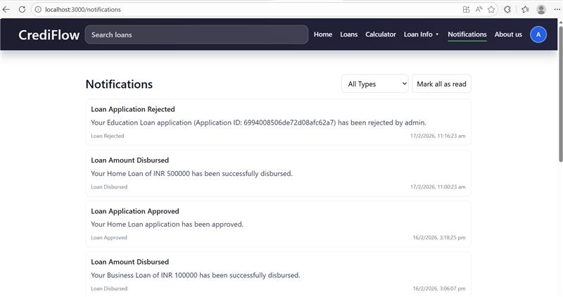

### Admin Screens

#### Admin Login
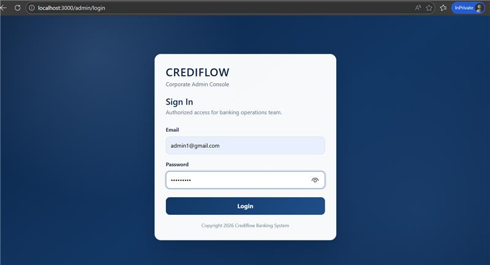

#### Admin Dashboard
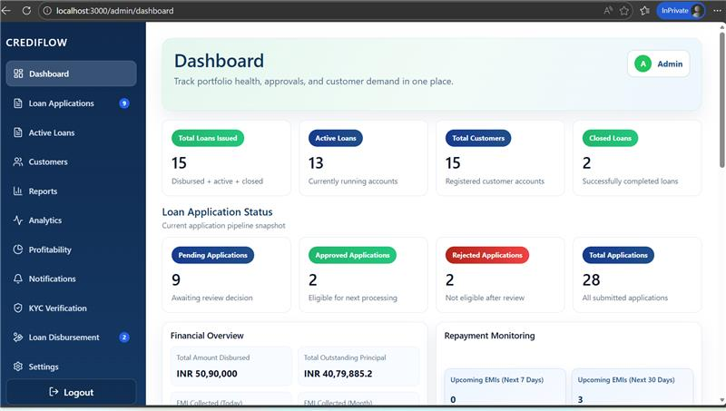

#### Loan Applications
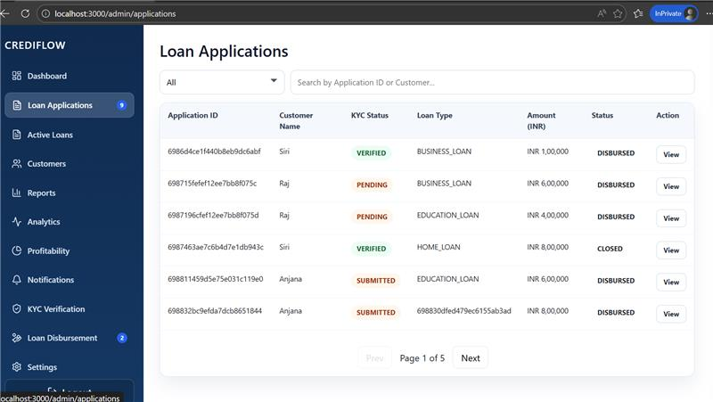

#### Active Loans
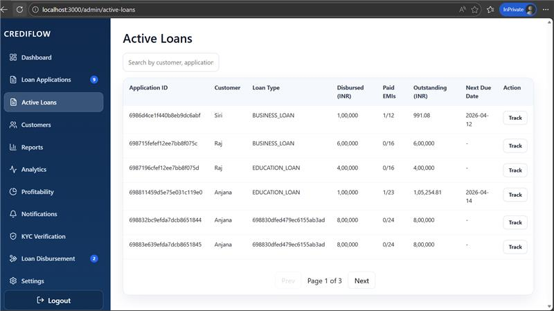

#### Customers
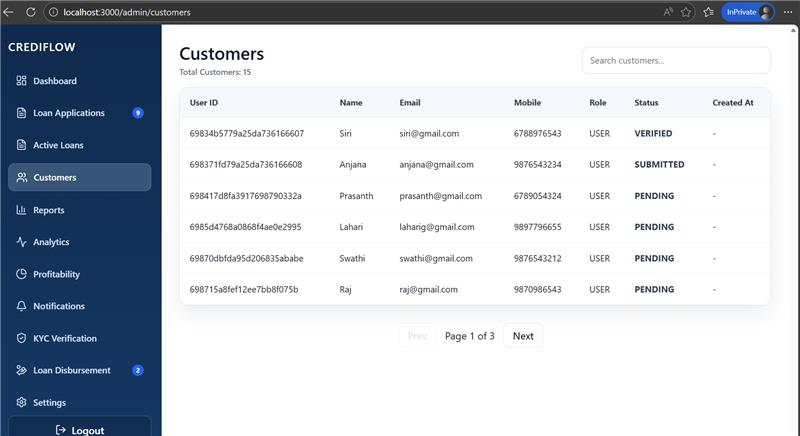

#### KYC Verification Queue
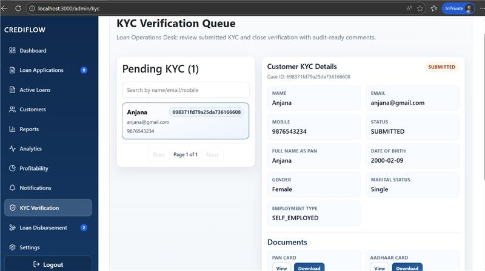

#### Loan Disbursement
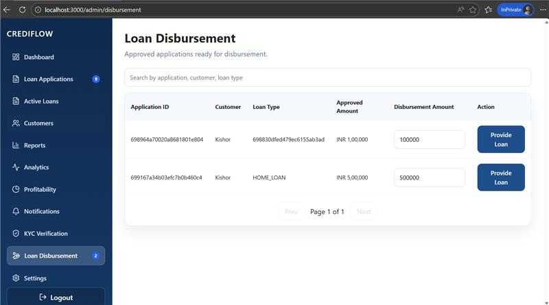

#### Analytics
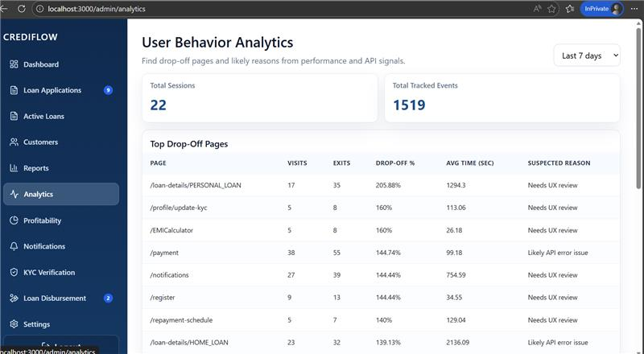

#### Reports (Audit)
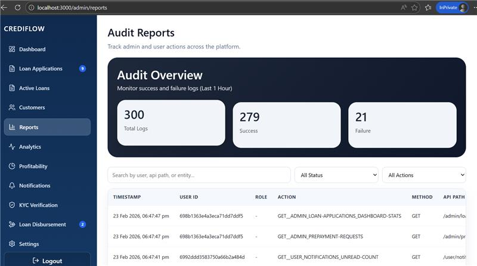

#### Profitability
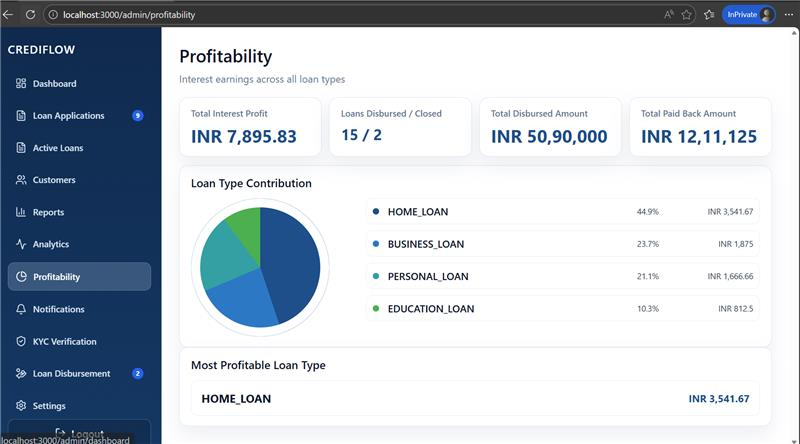
